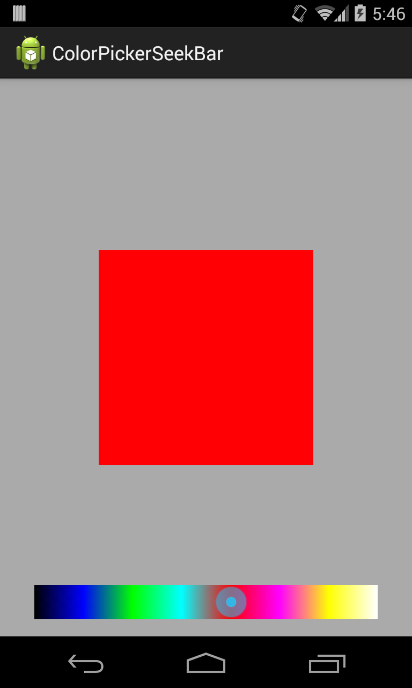

ColorPickerSeekBar
==================

ColorPickerSeekBar is an extension of SeekBar Android Widget for choosing a color. User can touch the thumb and drag left or right to set the color.

Contains 2 modules
1. ColorPickerSeekBar (com.ak.android.widget.colorpickerseekbar) which is an Android Library
2. ColorPickerSampleApp - A sample app showing how to use the above library

To use the ColorPickerSeekBar all you have to do is import the library, add it as a dependency and define the view

~~~
 <com.ak.android.widget.colorpickerseekbar.ColorPickerSeekBar
        android:layout_width="match_parent"
        android:layout_height="wrap_content"
        android:id="@+id/colorpicker"/>
~~~

To receive color change events when the user drags along the seekbar register a ColorPickerSeekBar.OnColorSeekBarChangeListener

~~~

colorPickerSeekBar.setOnColorSeekbarChangeListener(new ColorPickerSeekBar.OnColorSeekBarChangeListener() {
            @Override
            public void onColorChanged(SeekBar seekBar, int color, boolean fromUser) {
                view.setBackgroundColor(color);
            }

            @Override
            public void onStartTrackingTouch(SeekBar seekBar) {

            }

            @Override
            public void onStopTrackingTouch(SeekBar seekBar) {

            }
        });

~~~
